# Heart Disease MLOps Assignment — Final Report

**Course:** Machine Learning Operations (MLOps) AIMLCZG523
**Assignment:** 01
**GitHub Repository:** [https://github.com/2024ac05660-hub/MLOPS](https://github.com/2024ac05660-hub/MLOPS)

---

## Table of Contents

1. [Project Overview](#1-project-overview)
2. [Setup & Installation Instructions](#2-setup--installation-instructions)
3. [EDA Findings](#3-eda-findings)
4. [Feature Engineering](#4-feature-engineering)
5. [Model Comparison](#5-model-comparison)
6. [Experiment Tracking (MLflow)](#6-experiment-tracking-mlflow)
7. [Model Packaging & Reproducibility](#7-model-packaging--reproducibility)
8. [CI/CD Pipeline](#8-cicd-pipeline)
9. [Docker Containerisation](#9-docker-containerisation)
10. [Production Deployment (Kubernetes)](#10-production-deployment-kubernetes)
11. [Monitoring & Logging](#11-monitoring--logging)
12. [Architecture Diagram](#12-architecture-diagram)

---

## 1. Project Overview

### Problem Statement

Heart disease is one of the leading causes of death globally. Early and accurate prediction of heart disease risk from patient health data can significantly improve outcomes. This project builds a production-ready machine learning classifier that predicts the presence or absence of heart disease from 13 clinical features, and deploys it as a fully monitored, containerised REST API.

### Dataset

| Property | Value |
| --- | --- |
| Name | Heart Disease UCI Dataset |
| Source | UCI Machine Learning Repository (Cleveland Clinic) |
| Samples | 303 patients |
| Features | 13 numeric (age, sex, chest pain type, blood pressure, cholesterol, etc.) |
| Target | Binary — 0 = No Heart Disease, 1 = Heart Disease |
| Class ratio | 54% No Disease / 46% Disease (near-balanced) |

### Objectives

- Build and compare at least 3 ML classifiers with hyperparameter tuning
- Track all experiments with MLflow (parameters, metrics, artifacts, model versions)
- Serve predictions via a FastAPI REST API with Prometheus monitoring
- Package everything in Docker and deploy to Kubernetes (Minikube)
- Automate the full lifecycle with GitHub Actions CI/CD

### Tools & Technologies

| Category | Tool |
| --- | --- |
| Language | Python 3.10 |
| ML Framework | scikit-learn |
| Experiment Tracking | MLflow |
| API Framework | FastAPI + Uvicorn |
| Containerisation | Docker (multi-stage) |
| Orchestration | Kubernetes / Minikube + Helm |
| CI/CD | GitHub Actions |
| Monitoring | Prometheus + Grafana |
| Testing | Pytest (34 unit tests) |

---

## 2. Setup & Installation Instructions

### Prerequisites

- Python 3.10+
- Docker Desktop (running)
- Minikube (for Kubernetes deployment)
- Git

### Step-by-Step Setup

```bash
# 1. Clone the repository
git clone https://github.com/2024ac05660-hub/MLOPS.git
cd MLOPS

# 2. Create and activate virtual environment
python -m venv venv
source venv/bin/activate          # Windows: venv\Scripts\activate

# 3. Install all dependencies
pip install -r requirements.txt

# 4. Dataset is already included — or re-download:
python scripts/download_data.py

# 5. Preprocess data (generates data/processed/heart_disease_clean.csv)
PYTHONPATH=src python src/data_processing.py

# 6. Train all three models (logs to MLflow automatically)
PYTHONPATH=src python src/train.py

# 7. View MLflow UI
mlflow ui --backend-store-uri ./mlruns --port 5000
# Open http://localhost:5000

# 8. Run the API locally
PYTHONPATH=src:api uvicorn api.app:app --host 0.0.0.0 --port 8080

# 9. Test the API
curl -X POST http://localhost:8080/predict \
  -H "Content-Type: application/json" \
  -d @tests/sample_input.json
```

### Conda Environment (alternative)

```bash
conda env create -f environment.yml
conda activate heart-disease-mlops
```

### Run Tests

```bash
PYTHONPATH=src pytest tests/test_data_processing.py tests/test_model.py -v
# Expected: 34 passed
```

### Docker Quick Start

```bash
docker build -t heart-disease-api:latest .
docker run -d -p 8080:8080 heart-disease-api:latest
curl http://localhost:8080/health
```

### Full Stack (API + Prometheus + Grafana)

```bash
docker-compose up -d
# API:        http://localhost:8080/docs
# Prometheus: http://localhost:9090
# Grafana:    http://localhost:3000  (admin / admin123)
```

---

## 3. EDA Findings

### 3.1 Missing Values

The raw dataset contains `?` values in `ca` (4 rows) and `thal` (2 rows). These are replaced with column medians.

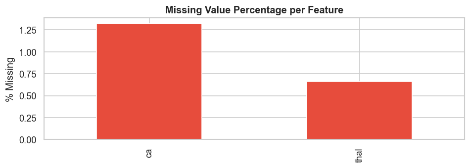

### 3.2 Class Distribution

The dataset is near-balanced: 164 patients with no disease (54%) and 139 with disease (46%). No oversampling was required.

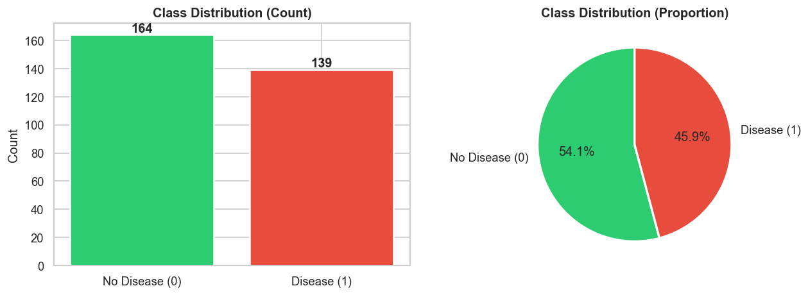

### 3.3 Continuous Feature Distributions

Max heart rate (`thalach`) is clearly lower for disease patients. ST depression (`oldpeak`) is higher for disease patients. Age shows a moderate positive relationship with disease.

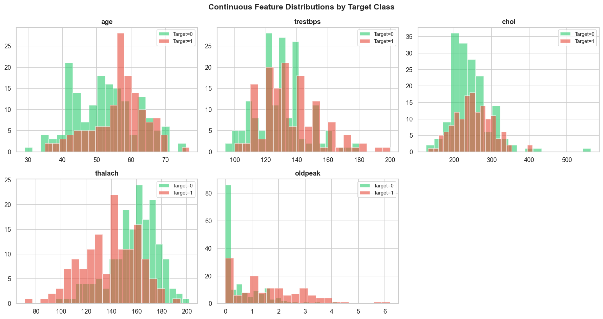

### 3.4 Categorical Feature Counts

`cp` (chest pain type 4 = asymptomatic) and `ca` (number of blocked vessels) are the strongest categorical predictors of heart disease.

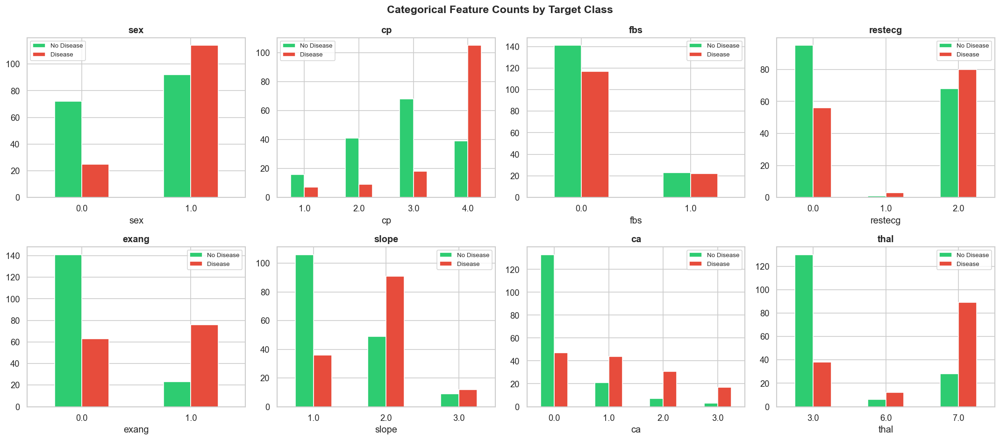

### 3.5 Correlation Heatmap

Top correlations with target: `thalach` (−0.42), `oldpeak` (+0.43), `ca` (+0.47), `cp` (−0.41), `exang` (+0.44).

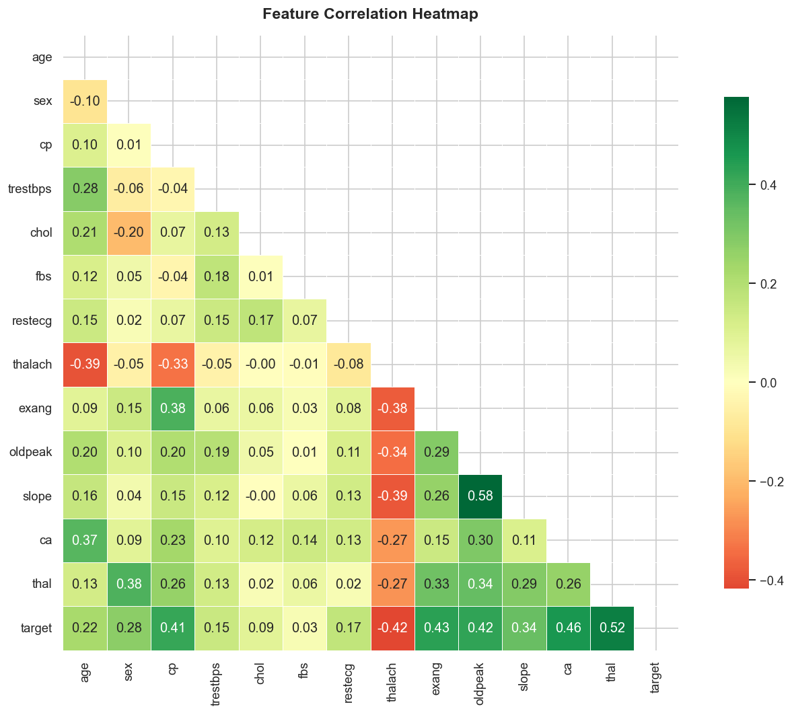

### 3.6 Boxplots — Continuous Features vs Target

Clear separation visible in `thalach` and `oldpeak` between disease and non-disease groups.

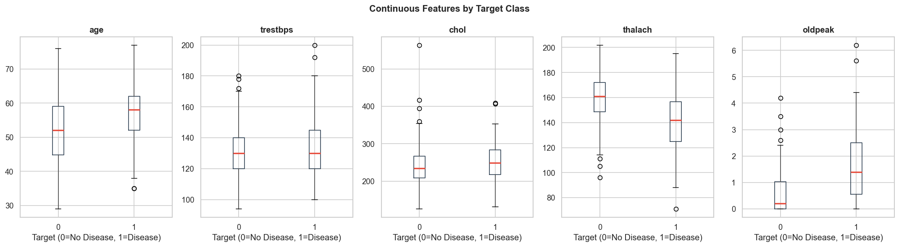

### 3.7 Feature Relationship Analysis (Pairplot)

Pairwise relationships between continuous features coloured by target class — confirms `thalach` vs `oldpeak` shows strongest class separation.

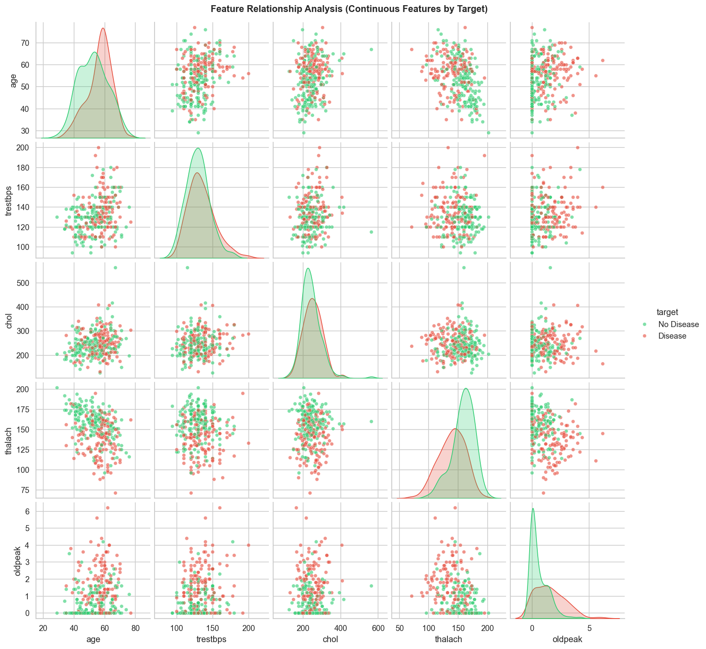

---

## 4. Feature Engineering

All 13 features are used. A `ColumnTransformer` applies separate preprocessing pipelines:

| Feature | Type | Preprocessing |
| --- | --- | --- |
| age, trestbps, chol, thalach, oldpeak | Continuous | Median imputation + StandardScaler |
| sex, cp, fbs, restecg, exang, slope, ca, thal | Categorical | Median imputation only |

The `ColumnTransformer` is wrapped inside a `sklearn.Pipeline` together with the classifier. This ensures the scaler is fit only on training data, preventing any data leakage to the test set. The full pipeline (preprocessor + classifier) is what gets serialised and served at inference time.

---

## 5. Model Comparison

Three classifiers were trained and compared. All three used **GridSearchCV (cv=5, scoring=roc_auc)** for hyperparameter tuning.

### 5.1 Hyperparameter Search Space

| Model | Parameter | Values Searched | Best Value |
| --- | --- | --- | --- |
| Logistic Regression | C | [0.01, 0.1, 1.0, 10.0] | 10.0 |
| Random Forest | n_estimators | [100, 200] | 200 |
| Random Forest | max_depth | [4, 6, None] | 6 |
| Random Forest | min_samples_split | [2, 5] | 2 |
| Gradient Boosting | n_estimators | [100, 150] | 100 |
| Gradient Boosting | learning_rate | [0.05, 0.1] | 0.05 |
| Gradient Boosting | max_depth | [3, 4] | 3 |

### 5.2 Performance Metrics (Test Set, 20% holdout)

| Model | Accuracy | Precision | Recall | F1 | ROC-AUC | CV AUC (5-fold) |
| --- | --- | --- | --- | --- | --- | --- |
| Logistic Regression | 0.869 | 0.812 | 0.929 | 0.867 | 0.949 | 0.890 |
| **Random Forest** | **0.902** | **0.867** | **0.929** | **0.897** | **0.952** | **0.895** |
| Gradient Boosting | 0.836 | 0.765 | 0.929 | 0.839 | 0.948 | 0.864 |

**Best model: Random Forest** (ROC-AUC = 0.952, Accuracy = 90.2%)

### 5.3 Model Selection Rationale

Random Forest was selected as the best model because:

- Highest ROC-AUC (0.952) — most important metric for a medical diagnosis task
- Highest overall accuracy (90.2%) and F1 score (0.897)
- Robust to outliers, handles non-linear feature interactions
- Feature importance scores interpretable for clinical context

### 5.4 ROC Curves

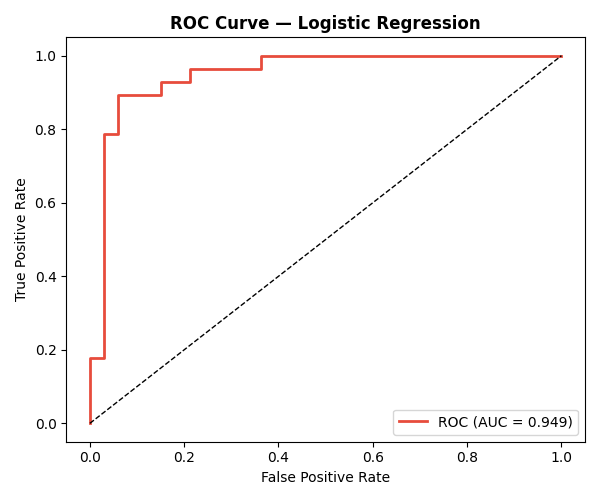

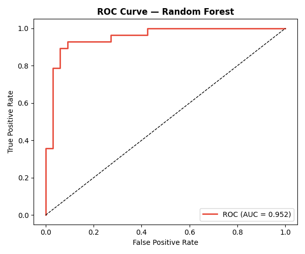

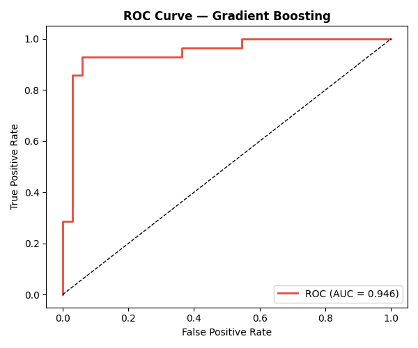

### 5.5 Confusion Matrices

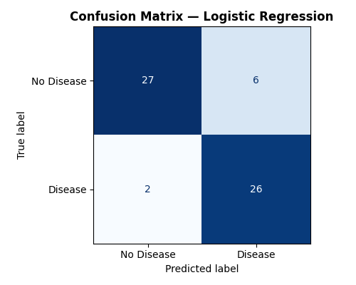

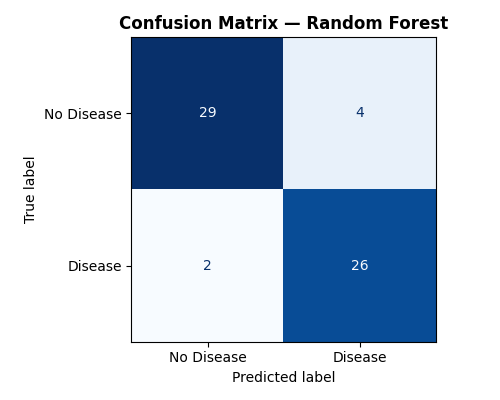

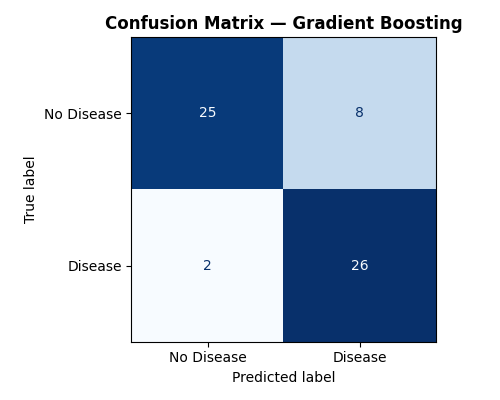

### 5.6 Feature Importances

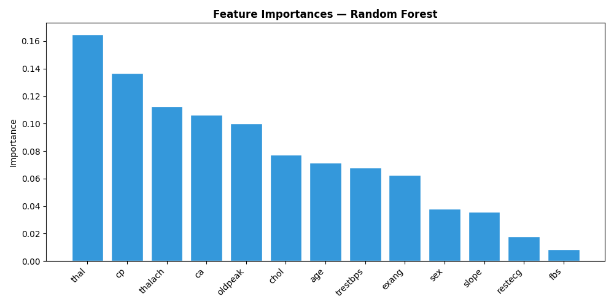

Top predictors from Random Forest: `ca` (blocked vessels), `thal` (thalassemia type), `cp` (chest pain type), `oldpeak` (ST depression), `thalach` (max heart rate).

---

## 6. Experiment Tracking (MLflow)

### What was logged per run

| Category | Details |
| --- | --- |
| Parameters | All hyperparameters (C, n_estimators, max_depth, learning_rate, etc.) |
| Metrics | accuracy, precision, recall, F1, ROC-AUC, CV accuracy, CV ROC-AUC |
| Artifacts | ROC curve PNG, confusion matrix PNG, feature importance PNG, classification report TXT |
| Model | Serialised sklearn Pipeline registered in MLflow Model Registry |
| Tags | `model_name` tag on each run for easy filtering |

### How to view the MLflow UI

```bash
mlflow ui --backend-store-uri ./mlruns --port 5000
# Open http://localhost:5000 in your browser
```

### Screenshot 1 — MLflow Registered Models (`http://localhost:5000/#/models`)

All three models registered in the MLflow Model Registry — Gradient_Boosting, Logistic_Regression,
Random_Forest — each at Version 4.

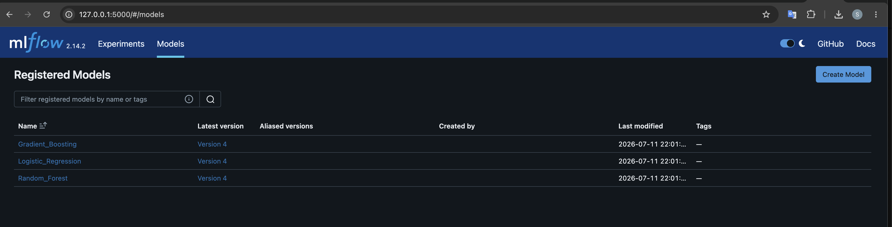

### Screenshot 2 — MLflow Model Version Details (`http://localhost:5000/#/models/Gradient_Boosting`)

Gradient Boosting model showing 4 versions across all training runs, with timestamps.

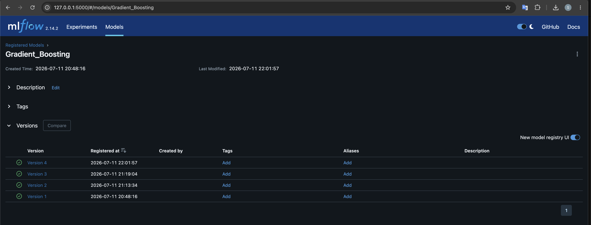

---

## 7. Model Packaging & Reproducibility

### Saved Files

```text
models/
├── best_model.pkl       # Full sklearn Pipeline (ColumnTransformer + RandomForest)
└── model_meta.json      # Best model name + final metrics
```

The `best_model.pkl` file contains the **complete end-to-end pipeline** — a single `model.predict(X_raw)` call runs imputation, scaling, and prediction with no separate preprocessing step needed.

### Serialisation Format

- **Primary:** Pickle (`.pkl`) — used by the serving API
- **MLflow format:** All models also registered in MLflow Model Registry (`mlruns/models/`)
- **ONNX:** Optional export shown in `notebooks/03_inference.ipynb`

### Preprocessing Reproducibility

The `ColumnTransformer` inside `best_model.pkl` stores the fitted `StandardScaler` mean and variance
from training data. Inference on new data uses exactly the same transformation — no risk of
train/test leakage or inconsistent scaling.

---

## 8. CI/CD Pipeline

**Tool:** GitHub Actions
**File:** `.github/workflows/ci.yml`

### Pipeline Flow

```text
git push to main / pull request
         │
         ▼
  ┌─────────────────┐
  │   1. Lint       │  flake8 (PEP8) + black --check (formatting)
  │                 │  Fails pipeline if any violation found
  └────────┬────────┘
           │ pass
           ▼
  ┌─────────────────┐
  │   2. Unit Test  │  pytest tests/ with --cov coverage report
  │                 │  34 tests across data, model, API modules
  └────────┬────────┘
           │ pass
           ▼
  ┌─────────────────┐
  │   3. Train      │  python src/data_processing.py + src/train.py
  │                 │  Verifies best_model.pkl is created correctly
  └────────┬────────┘
           │ pass
           ▼
  ┌─────────────────┐
  │   4. Docker     │  docker build → run → /health check → /predict smoke test
  │                 │  Fails if container does not respond correctly
  └─────────────────┘
```

### Artifacts Uploaded per Run

- `test-results.xml` — JUnit test report (visible in GitHub Actions summary)
- `coverage.xml` — test coverage report
- `trained-model/` — `best_model.pkl` + `model_meta.json`
- `mlflow-runs/` — full MLflow tracking data
- `training-plots/` — ROC, confusion matrix, feature importance PNGs

### Failure Behaviour

The pipeline is configured with `needs:` dependencies — if lint fails, testing never runs; if testing
fails, training never runs; if training fails, Docker build never runs. Broken code never reaches
the container stage.

### Screenshot 3 — Unit Tests Passing (Terminal)

All 34 unit tests pass across data processing, model inference, and pipeline serialisation.
Run command: `PYTHONPATH=src pytest tests/test_data_processing.py tests/test_model.py -v`

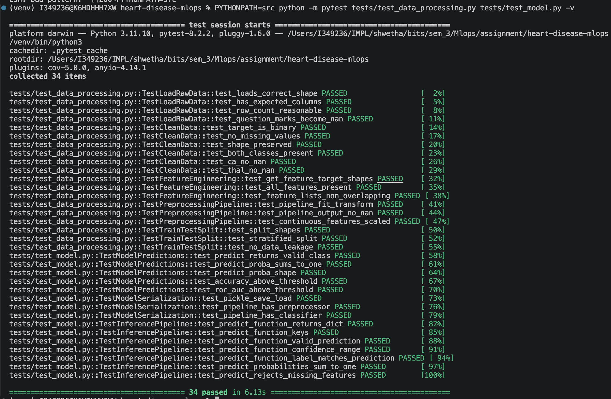

### Screenshot 13 — GitHub Actions CI/CD Pipeline (`https://github.com/2024ac05660-hub/MLOPS/actions`)

All 4 stages green — Lint (flake8 + black) ✅ Unit Tests ✅ Model Training ✅ Docker Build & Smoke Test ✅

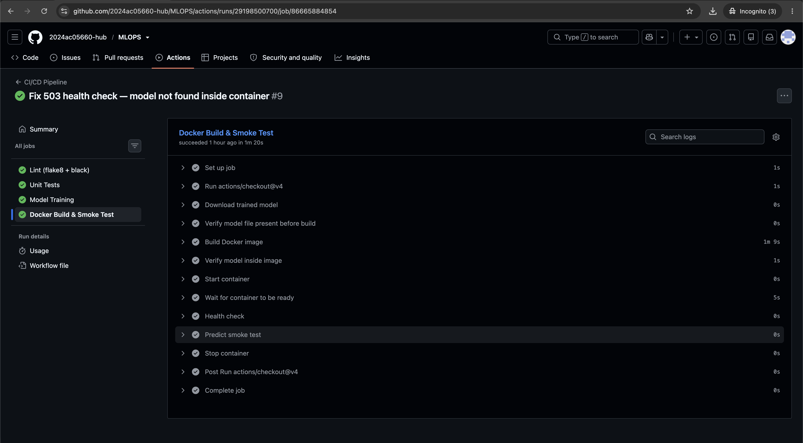

---

## 9. Docker Containerisation

### Multi-stage Dockerfile

| Stage | Base | Purpose |
| --- | --- | --- |
| `builder` | python:3.10-slim | Install all pip packages |
| `runtime` | python:3.10-slim | Copy packages + app code, run as non-root user |

The multi-stage build keeps the final image lean — build tools and pip cache are discarded.

### Container Contents

- `api/app.py` — FastAPI application
- `src/` — data processing + inference modules
- `models/best_model.pkl` — trained model
- All pip dependencies from `requirements.txt`

### Build and Test Commands

```bash
# Build
docker build -t heart-disease-api:latest .

# Run
docker run -d -p 8080:8080 --name hd-api heart-disease-api:latest

# Health check
curl http://localhost:8080/health

# Predict
curl -X POST http://localhost:8080/predict \
  -H "Content-Type: application/json" \
  -d @tests/sample_input.json

# Swagger UI (interactive)
open http://localhost:8080/docs

# Stop
docker stop hd-api && docker rm hd-api
```

### API Endpoints

| Endpoint | Method | Description |
| --- | --- | --- |
| `/` | GET | Service information |
| `/health` | GET | Liveness probe — returns model_loaded status |
| `/predict` | POST | Heart disease prediction + confidence |
| `/sample` | GET | Sample JSON input for testing |
| `/docs` | GET | Interactive Swagger UI |
| `/metrics` | GET | Prometheus metrics scrape endpoint |

### Sample Prediction

**Request:**

```json
{"age":55,"sex":1,"cp":4,"trestbps":140,"chol":217,"fbs":0,
 "restecg":2,"thalach":111,"exang":1,"oldpeak":5.6,"slope":3,"ca":0,"thal":7}
```

**Response:**

```json
{
  "prediction": 1,
  "label": "Heart Disease",
  "confidence": 0.931,
  "probabilities": {"no_disease": 0.069, "disease": 0.931},
  "model_version": "1.0.0",
  "timestamp": "2026-07-12T16:30:15+00:00"
}
```

### Screenshot 4 — Swagger UI `/predict` (`http://localhost:8080/docs`)

Swagger UI showing the POST /predict endpoint with sample JSON input. The curl command and
request body are visible at the bottom.

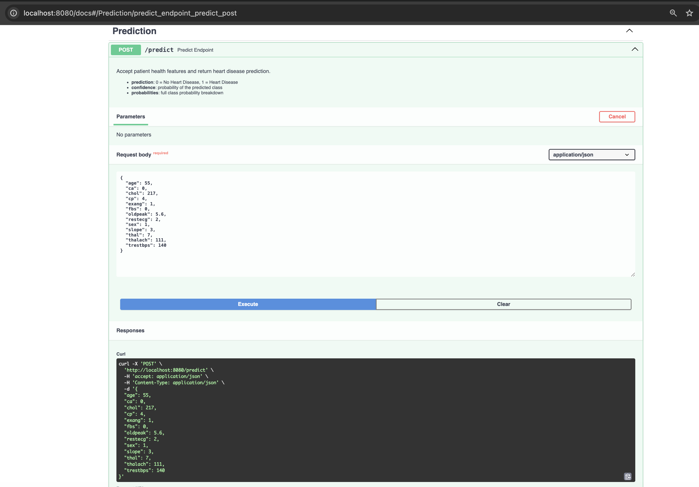

### Screenshot 5 — Docker Build Output (Terminal)

Multi-stage Docker build completing successfully — all 17 build steps finished in 114.9s.
The build context is only 1.10 MB thanks to `.dockerignore`.

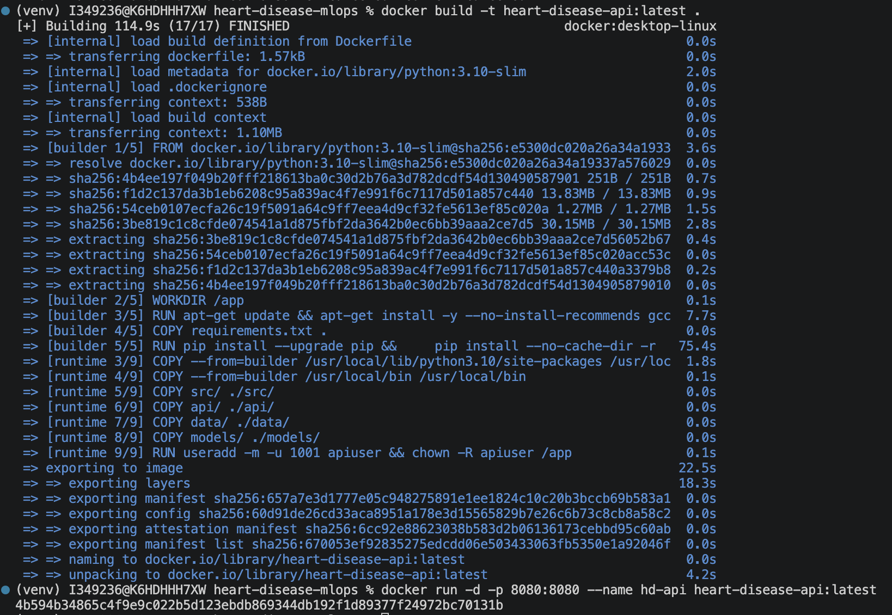

### Screenshot 6 — Docker Container Running (`docker ps`)

Container `hd-api` running with status `Up 5 minutes (healthy)` on `0.0.0.0:8080->8080/tcp`.

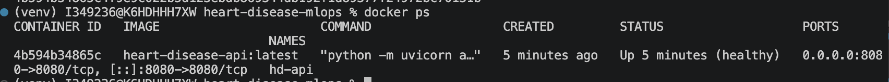

### Screenshot 7 — Docker Desktop Containers

Docker Desktop showing all running containers — `heart-disease-api` (8080:8080),
`prometheus` (9090:9090), and `grafana` (3000:3000) all healthy.

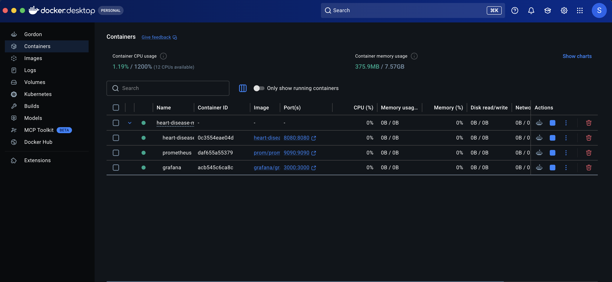

### Screenshot — API Health Check (`http://localhost:8080/health`)

Browser confirming the API is live with `{"status":"ok","model_loaded":true}`.

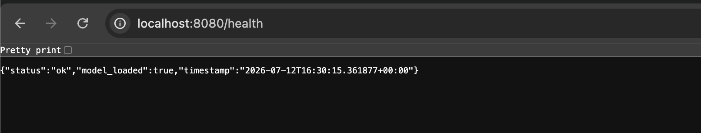

---

## 10. Production Deployment (Kubernetes)

### Deployment on Minikube (Local Kubernetes)

```bash
# 1. Start Minikube cluster
~/minikube start --driver=docker --memory=4096

# 2. Load local Docker image into Minikube
~/minikube image load heart-disease-api:latest

# 3. Apply all Kubernetes manifests
kubectl apply -f k8s/deployment.yaml   # 2-replica Deployment
kubectl apply -f k8s/service.yaml      # LoadBalancer Service
kubectl apply -f k8s/hpa.yaml          # Horizontal Pod Autoscaler

# 4. Watch pods start up
kubectl get pods -w

# 5. Get the service URL (keep this terminal open)
~/minikube service heart-disease-api --url

# 6. Test the deployed API
curl <URL>/health
curl -X POST <URL>/predict \
  -H "Content-Type: application/json" \
  -d @tests/sample_input.json
```

### Using Helm

```bash
helm install heart-disease ./helm/heart-disease-api
helm status heart-disease
kubectl get pods
```

### Kubernetes Resources

| Resource | Config |
| --- | --- |
| Deployment | 2 replicas, rolling update (maxSurge=1, maxUnavailable=0) |
| Service | LoadBalancer, port 80 → pod 8080 |
| HPA | Min 2 / Max 6 replicas, scale at 70% CPU |
| Ingress | nginx, host `heart-disease-api.local` |
| Probes | Liveness + readiness at `/health` |

### Screenshot 10+11 — Minikube in Docker Desktop

Minikube cluster running as a Docker container (`k8s-minikube`) with 26% CPU and 1.26 GB / 4 GB
memory usage.

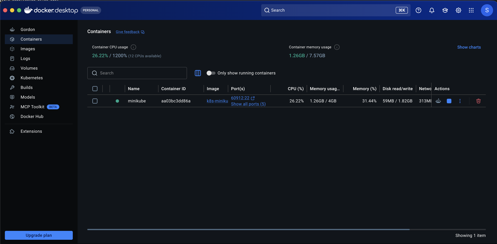

### Screenshot — kubectl get pods / svc / hpa + Minikube API Test

Both pods in `Running` state, LoadBalancer service on port 80:31816, HPA configured for 2–6
replicas. Health check and predict curl both succeed through the Minikube tunnel
`http://127.0.0.1:61321`.

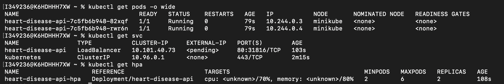

### Screenshot 12 — API Response via Minikube URL (`http://127.0.0.1:61321`)

`/health` returns `{"status":"ok","model_loaded":true}` and `/predict` returns
`{"prediction":1,"label":"Heart Disease","confidence":0.931}` — API fully functional
through Kubernetes.

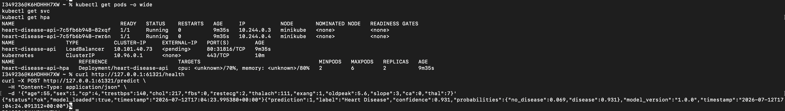

---

## 11. Monitoring & Logging

### Structured Request Logging

Every HTTP request is logged as a JSON line to stdout:

```json
{"time":"2026-07-12T16:30:15","level":"INFO",
 "message":"path=/predict method=POST status=200 duration=0.0120s client=127.0.0.1"}
```

### Prometheus Metrics

| Metric Name | Type | Description |
| --- | --- | --- |
| `hd_predictions_total` | Counter | Total predictions, labelled by class (0/1) |
| `hd_prediction_latency_seconds` | Histogram | Per-request inference latency |
| `hd_model_confidence` | Histogram | Distribution of model confidence scores |
| `hd_prediction_errors_total` | Counter | Count of failed predictions |
| `http_requests_total` | Counter | All HTTP requests (from Instrumentator) |

### Start Full Monitoring Stack

```bash
docker-compose up -d
# API:        http://localhost:8080
# Prometheus: http://localhost:9090  → query: hd_predictions_total
# Grafana:    http://localhost:3000  (admin / admin123)
```

### Screenshot 8 — Prometheus Metrics (`http://localhost:9090`)

Query `hd_predictions_total` showing `prediction_class="0"` = 16 and `prediction_class="1"` = 15,
Result series: 2. Confirms Prometheus is scraping the API's `/metrics` endpoint successfully.

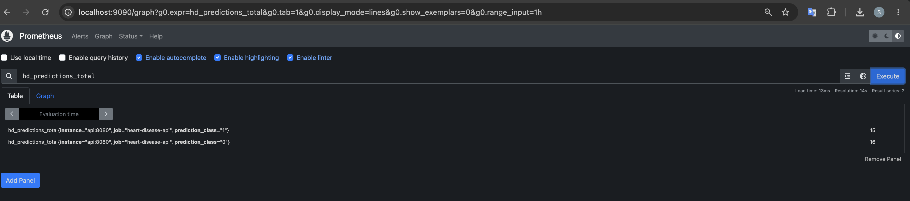

### Screenshot 9 — Grafana Dashboard (`http://localhost:3000`)

Heart Disease API Dashboard auto-provisioned at `http://localhost:3000/d/hd-api-dashboard`:

- **Total Predictions:** 31
- **Predictions by Class:** pie chart showing Class 0 vs Class 1 split
- **Prediction Latency p95:** 17.2 ms
- **Request Rate:** timeseries for GET /health, GET /metrics, POST /predict
- **Prediction Errors:** 0
- **Confidence Score Distribution:** histogram showing high-confidence predictions

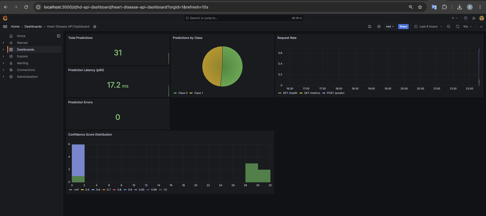

---

## 12. Architecture Diagram

```text
┌────────────────────────────────────────────────────────────────┐
│                    Developer Workstation                       │
│                                                                │
│  ┌──────────┐   git push    ┌──────────────────────────────┐   │
│  │  Code    │ ────────────► │    GitHub Actions CI/CD      │   │
│  │  MLflow  │               │  Lint → Test → Train → Docker│   │
│  │  Jupyter │               └──────────────┬───────────────┘   │
│  └──────────┘                              │ artifacts         │
└────────────────────────────────────────────┼───────────────────┘
                                             │
                    ┌────────────────────────▼─────────────────┐
                    │         Docker Image Registry             │
                    │         heart-disease-api:latest         │
                    └────────────────────────┬─────────────────┘
                                             │ kubectl apply / helm install
                    ┌────────────────────────▼─────────────────┐
                    │     Kubernetes Cluster (Minikube)         │
                    │                                           │
                    │  ┌─────────────────────────────────────┐  │
                    │  │          Ingress (nginx)             │  │
                    │  └───────────────┬─────────────────────┘  │
                    │                  │                         │
                    │  ┌───────────────▼─────────────────────┐  │
                    │  │    Service (LoadBalancer :80)        │  │
                    │  └───────────────┬─────────────────────┘  │
                    │                  │                         │
                    │  ┌───────────────▼─────────────────────┐  │
                    │  │   Deployment (2 replicas + HPA)     │  │
                    │  │  ┌─────────────┐  ┌─────────────┐   │  │
                    │  │  │   Pod 1     │  │   Pod 2     │   │  │
                    │  │  │FastAPI:8080 │  │FastAPI:8080 │   │  │
                    │  │  └─────────────┘  └─────────────┘   │  │
                    │  └─────────────────────────────────────┘  │
                    └────────────────────────┬─────────────────┘
                                             │ /metrics scrape
                    ┌────────────────────────▼─────────────────┐
                    │           Monitoring Stack                │
                    │   Prometheus (:9090) → Grafana (:3000)   │
                    └───────────────────────────────────────────┘
```

---

## Repository Structure

```text
heart-disease-mlops/
├── .github/
│   └── workflows/ci.yml              # GitHub Actions — 4-stage CI/CD
├── api/
│   └── app.py                        # FastAPI app with /predict + /metrics
├── data/
│   ├── raw/processed.cleveland.data  # Raw UCI Cleveland dataset
│   └── processed/                    # Cleaned CSV (auto-generated)
├── helm/heart-disease-api/           # Helm chart (Chart.yaml + values.yaml)
├── k8s/
│   ├── deployment.yaml               # 2-replica Kubernetes Deployment
│   ├── service.yaml                  # LoadBalancer Service
│   ├── hpa.yaml                      # Horizontal Pod Autoscaler
│   └── ingress.yaml                  # Nginx Ingress
├── models/                           # Trained model artifacts (auto-generated)
├── monitoring/
│   ├── prometheus.yml                # Prometheus scrape config
│   └── grafana/provisioning/         # Auto-provisioned Grafana dashboard
├── notebooks/
│   ├── 01_eda.ipynb                  # EDA notebook with all visualisations
│   ├── 02_training.ipynb             # Training + MLflow tracking notebook
│   └── 03_inference.ipynb            # Inference + batch prediction notebook
├── report/
│   ├── MLOps_Assignment_Report.md    # This report (source)
│   └── report_*.txt                  # Per-model classification reports
├── screenshots/                      # All pipeline + EDA + model screenshots
├── scripts/
│   ├── download_data.py              # Dataset download script
│   └── run_eda.py                    # Headless EDA script for CI
├── src/
│   ├── data_processing.py            # Cleaning + ColumnTransformer pipeline
│   ├── train.py                      # Training + GridSearchCV + MLflow logging
│   └── predict.py                    # Inference helper
├── tests/
│   ├── test_data_processing.py       # 19 unit tests — data pipeline
│   ├── test_model.py                 # 15 unit tests — model + inference
│   ├── test_api.py                   # 11 unit tests — FastAPI endpoints
│   └── sample_input.json             # Sample patient JSON for smoke tests
├── conftest.py                       # pytest sys.path configuration
├── docker-compose.yml                # API + Prometheus + Grafana stack
├── Dockerfile                        # Multi-stage production Docker image
├── environment.yml                   # Conda environment specification
├── requirements.txt                  # pip dependencies (pinned versions)
└── README.md                         # Quick start guide
```

---

## Access Instructions

| Method | Command | URL |
| --- | --- | --- |
| Raw Python | `PYTHONPATH=src:api uvicorn api.app:app --port 8080` | [http://localhost:8080](http://localhost:8080) |
| Docker | `docker run -p 8080:8080 heart-disease-api:latest` | [http://localhost:8080](http://localhost:8080) |
| Docker Compose | `docker-compose up -d` | [http://localhost:8080](http://localhost:8080) |
| Prometheus | `docker-compose up -d` | [http://localhost:9090](http://localhost:9090) |
| Grafana | `docker-compose up -d` | [http://localhost:3000](http://localhost:3000) (admin/admin123) |
| Kubernetes | `~/minikube service heart-disease-api --url` | dynamic (e.g. [http://127.0.0.1:61321](http://127.0.0.1:61321)) |

Swagger UI (interactive API docs): [http://localhost:8080/docs](http://localhost:8080/docs)

---

## Video Recording

A short video recording demonstrating the full end-to-end pipeline is available here:

**[Watch Pipeline Recording on Google Drive](https://drive.google.com/file/d/15icPkiUXLxpKBhezTPU-mOw8ve2wLT8Z/view?usp=drive_link)**

The video covers:

- MLflow experiment tracking UI (`http://localhost:5000`)
- Unit tests passing (34 tests)
- Docker build and container run
- FastAPI `/predict` endpoint via Swagger UI
- Prometheus metrics and Grafana dashboard
- Kubernetes deployment on Minikube
- GitHub Actions CI/CD pipeline (all 4 stages green)
